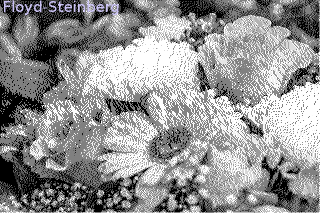
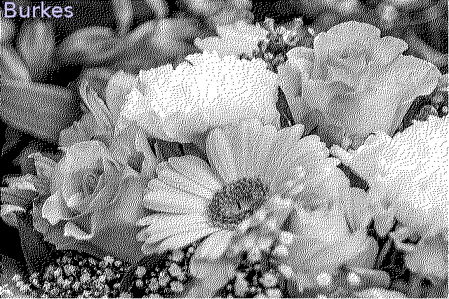

# dithering-in-racket
Floyd-Steinberg and Burkes dithering implementations in Racket

I wrote these functions to print images to a thermal receipt printer, which has only black and white pixels.

Exported functions are:
`bitmap->floyd-steinberg`
`bitmap->burkes`

Each accepts an alpha-red-green-blue `argb` bitmap and produces and returns a dithered bitmap also in `argb` format, but with each pixel either pure white or pure black.

These exprs are demo/test code (e.g. type them into REPL):
```
(require net/url)
(define flowers
 (read-bitmap
  (get-pure-port
   (string->url "https://www.almanac.com/sites/default/files/birth_month_flowers-primary-1920x1280px_pixabay.jpg"))
   #:backing-scale 3.))
flowers
(bitmap->floyd-steinberg flowers)
(bitmap->burkes flowers)
```





